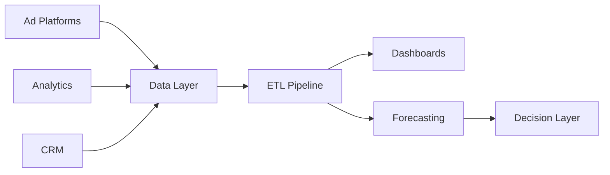

 

 

---

## SYSTEM PROFILE

<table width="100%">
<tr>
<td width="62%" valign="top">

### I build systems that turn scattered data into decisions.

I work across the full data-to-product layer: collecting information from different sources, transforming it into reliable pipelines, and turning it into dashboards, AI workflows, and automation that teams can actually use.

My current focus is building a multi-source marketing intelligence system that connects ads, analytics, CRM, and business data into one decision layer.

</td>
<td width="32%" valign="top">

  
  
  

</td>
</tr>
</table>

 

<table width="100%">
<tr>
<td width="25%" align="center">

**01 · Data Systems**  
ETL · BigQuery · integrations

</td>
<td width="25%" align="center">

**02 · AI Workflows**  
RAG · agents · retrieval

</td>
<td width="25%" align="center">

**03 · Product Tools**  
dashboards · internal systems

</td>
<td width="25%" align="center">

**04 · Decision Layer**  
KPIs · forecasting · automation

</td>
</tr>
</table>

---

## CURRENT BUILD

<table width="100%">
<tr>
<td width="70%" valign="top">

### Multi-Source Marketing Intelligence System

A business intelligence layer that connects marketing, analytics, CRM, and client data into one system for performance tracking, forecasting, and faster decision-making.

</td>
<td width="30%" valign="top">

</td>
</tr>
</table>

---

## PROFESSIONAL TIMELINE

<table width="100%">
<tr>
<td align="right" width="23%" valign="top">

</td>
<td align="center" width="7%" valign="top">

<h2>●</h2>

</td>
<td width="70%" valign="top">

<h3>Data & Web Systems Engineer</h3>
<b>DreamShift INC</b> · Wyoming, USA 
Data engineering · AI workflows · dashboards · web systems

</td>
</tr>

<tr>
<td align="right" width="23%" valign="top">

</td>
<td align="center" width="7%" valign="top">

<h2>●</h2>

</td>
<td width="70%" valign="top">

<h3>Data Analytics & Operations Specialist</h3>
<b>DreamShift INC</b> · Wyoming, USA 
Analytics operations · CRM workflows · reporting systems

</td>
</tr>

<tr>
<td align="right" width="23%" valign="top">

</td>
<td align="center" width="7%" valign="top">

<h2>●</h2>

</td>
<td width="70%" valign="top">

<h3>English News Editor & Social Media Admin</h3>
<b>WIN365 Sports by Archnix</b> · Colombo, Sri Lanka 
Sports media · publishing workflows · social content

</td>
</tr>

<tr>
<td align="right" width="23%" valign="top">

</td>
<td align="center" width="7%" valign="top">

<h2>●</h2>

</td>
<td width="70%" valign="top">

<h3>Project Lead</h3>
<b>Barcelona Latest Sports Blog</b> · Sri Lanka 
Digital project leadership · content systems · audience growth

</td>
</tr>
</table>

---

## LEARNING PATH

<table width="100%">
<tr>
<td width="45%" valign="top" align="center">

  

<h3>Advanced Diploma in Data Science</h3>
<b>National Innovation Centre — NIBM</b> 
Sri Lanka

</td>
<td width="10%" align="center" valign="middle">

<h2>→</h2>

</td>
<td width="45%" valign="top" align="center">

  

<h3>HND in Data Science</h3>
<b>National Innovation Centre — NIBM</b> 
Sri Lanka

</td>
</tr>
</table>

---

## SELECTED BUILDS

<table width="100%">
<tr>
<td width="50%" valign="top">

### 🔄 ETL Marketing Pipeline

**Marketing intelligence pipeline for forecasting and KPI tracking.**

Connects ads, analytics, and CRM data into a cleaned reporting layer for dashboarding, trend monitoring, and decision support.

  

</td>
<td width="50%" valign="top">

### 🤖 Live AI Chatbot — DreamShift

**Serverless RAG agent for customer support workflows.**

Built with Cloudflare Workers, vector search, Markdown knowledge bases, and human-fallback routing for real business use.

  

</td>
</tr>
<tr>
<td width="50%" valign="top">

### 📊 SEO / SEM Dashboard

**Performance dashboard for marketing and search intelligence.**

Combines GA4, Meta Pixel, and Search Console signals into a dashboard layer for tracking growth, traffic quality, and campaign performance.

  

</td>
<td width="50%" valign="top">

### 👥 DreamShift EMS

**Internal employee management system for operational workflows.**

A full-stack system for employee lifecycle tracking, structured operations, workflow visibility, and reporting support.

  

</td>
</tr>
<tr>
<td width="50%" valign="top">

### 🎓 The Online Kuppiya

**MERN Q&A platform for Sri Lankan university students.**

Built around authentication, student knowledge sharing, gamified leaderboards, and a reputation-based contribution system.

  

</td>
<td width="50%" valign="top">

### ⚽ PitchLink — Euro 2024

**Sports analytics engine for match and condition-based forecasting.**

Explores tactical context, pitch conditions, and statistical variables to support sports prediction experiments.

  

</td>
</tr>
</table>

---

## TECH STACK

<table>
<tr>
<td align="center" width="90"> Python</td>
<td align="center" width="90"> TypeScript</td>
<td align="center" width="90"> JavaScript</td>
<td align="center" width="90"> React</td>
<td align="center" width="90"> MySQL</td>
<td align="center" width="90"> AWS</td>
<td align="center" width="90"> Docker</td>
<td align="center" width="90"> GitHub</td>
</tr>
<tr>
<td align="center" width="90"> MongoDB</td>
<td align="center" width="90"> Node.js</td>
<td align="center" width="90"> PHP</td>
<td align="center" width="90"> R</td>
<td align="center" width="90"> Linux</td>
<td align="center" width="90"> Git</td>
<td align="center" width="90"> Cloudflare</td>
<td align="center" width="90"> Tailwind</td>
</tr>
</table>

 

---

## GITHUB ACTIVITY

&nbsp;

  

---

<i>Building systems that turn data into decisions.</i>

  

