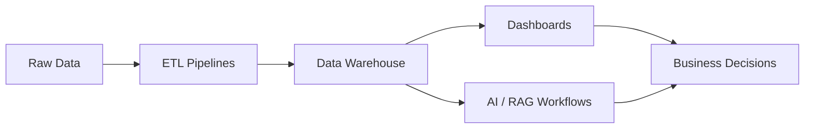

 

 

---

## 🧠 &nbsp; About Me

<table width="100%">
<tr>
<td width="68%" valign="top">

<h3>Building the layer between raw data and real decisions.</h3>

I design data and web systems that collect scattered information, structure it into usable pipelines, and turn it into dashboards, AI workflows, and automated business actions.

My work sits at the intersection of <b>data engineering</b>, <b>AI systems</b>, <b>business intelligence</b>, and <b>internal product development</b>.

</td>
<td width="32%" valign="top">

  
  
  

</td>
</tr>
</table>

 

<table width="100%">
<tr>
<td align="center" width="25%">
   
  <b>Collect</b> 
  Ads · Analytics · CRM · Web Data
</td>
<td align="center" width="25%">
   
  <b>Structure</b> 
  ETL · BigQuery · Data Models
</td>
<td align="center" width="25%">
   
  <b>Understand</b> 
  Dashboards · KPIs · Forecasting
</td>
<td align="center" width="25%">
   
  <b>Act</b> 
  Workflows · RAG · Decision Layers
</td>
</tr>
</table>

 

---

## 💼 &nbsp; Experience

<table width="100%">
<tr>
<td align="right" width="23%" valign="top">

</td>
<td align="center" width="7%" valign="top">

<h2>●</h2>

</td>
<td width="70%" valign="top">

<h3>Data & Web Systems Engineer</h3>
<b>DreamShift INC</b> · Wyoming, USA 
Data engineering · AI workflows · dashboards · web systems

</td>
</tr>

<tr>
<td align="right" width="23%" valign="top">

</td>
<td align="center" width="7%" valign="top">

<h2>●</h2>

</td>
<td width="70%" valign="top">

<h3>Data Analytics & Operations Specialist</h3>
<b>DreamShift INC</b> · Wyoming, USA 
Analytics operations · CRM workflows · reporting systems

</td>
</tr>

<tr>
<td align="right" width="23%" valign="top">

</td>
<td align="center" width="7%" valign="top">

<h2>●</h2>

</td>
<td width="70%" valign="top">

<h3>English News Editor & Social Media Admin</h3>
<b>WIN365 Sports by Archnix</b> · Colombo, Sri Lanka 
Sports media · publishing workflows · social content

</td>
</tr>

<tr>
<td align="right" width="23%" valign="top">

</td>
<td align="center" width="7%" valign="top">

<h2>●</h2>

</td>
<td width="70%" valign="top">

<h3>Project Lead</h3>
<b>Barcelona Latest Sports Blog</b> · Sri Lanka 
Digital project leadership · content systems · audience growth

</td>
</tr>
</table>

---

## 🎓 &nbsp; Education

<table width="100%">
<tr>
<td width="45%" valign="top" align="center">

  

<h3>HND in Data Science</h3>
<b>National Innovation Centre — NIBM</b> 
Sri Lanka

</td>
<td width="10%" align="center" valign="middle">

<h2>→</h2>

</td>
<td width="45%" valign="top" align="center">

  

<h3>Advanced Diploma in Data Science</h3>
<b>National Innovation Centre — NIBM</b> 
Sri Lanka

</td>
</tr>
</table>

---

## 🚀 &nbsp; Featured Projects

<table width="100%">
<tr>
<td width="50%" valign="top">

<h3>🔄 ETL Marketing Pipeline <code>In Progress</code></h3>

<b>Multi-source data pipeline for marketing intelligence.</b>

  

Connects ads, analytics, and CRM data into a forecasting-ready dashboard layer for KPI monitoring and trend analysis.

  

  

</td>
<td width="50%" valign="top">

<h3>🤖 Live AI Chatbot — DreamShift</h3>

<b>Serverless RAG agent for customer support workflows.</b>

  

Built with Cloudflare Workers, vector search, Markdown knowledge bases, and human-fallback routing.

  

  

</td>
</tr>

<tr>
<td width="50%" valign="top">

<h3>📊 SEO / SEM Dashboard</h3>

<b>Marketing performance intelligence layer.</b>

  

Combines GA4, Meta Pixel, and Search Console data into one dashboard for performance tracking and decision support.

  

  

</td>
<td width="50%" valign="top">

<h3>👥 DreamShift EMS</h3>

<b>Full-stack employee management system.</b>

  

Internal product system with employee lifecycle tracking, operational workflows, and reporting dashboards.

  

  

</td>
</tr>

<tr>
<td width="50%" valign="top">

<h3>🎓 The Online Kuppiya</h3>

<b>MERN Q&A platform for Sri Lankan university students.</b>

  

Includes authentication, gamified leaderboards, a reputation engine, and student-focused knowledge sharing.

  

  

</td>
<td width="50%" valign="top">

<h3>⚽ PitchLink — Euro 2024</h3>

<b>Sports analytics and match forecasting engine.</b>

  

Models pitch conditions, match context, and tactical variables for football/cricket-style forecasting experiments.

  

  

</td>
</tr>
</table>

 

---

## 🛠️ &nbsp; Tech Stack

<table>
<tr>
<td align="center" width="90"> Python</td>
<td align="center" width="90"> TypeScript</td>
<td align="center" width="90"> JavaScript</td>
<td align="center" width="90"> React</td>
<td align="center" width="90"> MySQL</td>
<td align="center" width="90"> AWS</td>
<td align="center" width="90"> Docker</td>
<td align="center" width="90"> GitHub</td>
</tr>
<tr>
<td align="center" width="90"> MongoDB</td>
<td align="center" width="90"> Node.js</td>
<td align="center" width="90"> PHP</td>
<td align="center" width="90"> R</td>
<td align="center" width="90"> Linux</td>
<td align="center" width="90"> Git</td>
<td align="center" width="90"> Cloudflare</td>
<td align="center" width="90"> Tailwind</td>
</tr>
</table>

 

---

## 📊 &nbsp; GitHub Stats

&nbsp;

  

  

---

## 🐍 &nbsp; Contribution Snake

<picture>
  <source media="(prefers-color-scheme: dark)" srcset="https://raw.githubusercontent.com/Navodhya-Fernando/Navodhya-Fernando/output/github-contribution-grid-snake-dark.svg"/>
  <source media="(prefers-color-scheme: light)" srcset="https://raw.githubusercontent.com/Navodhya-Fernando/Navodhya-Fernando/output/github-contribution-grid-snake.svg"/>
  
</picture>

---

*Building systems that turn data into decisions.*

 

  

